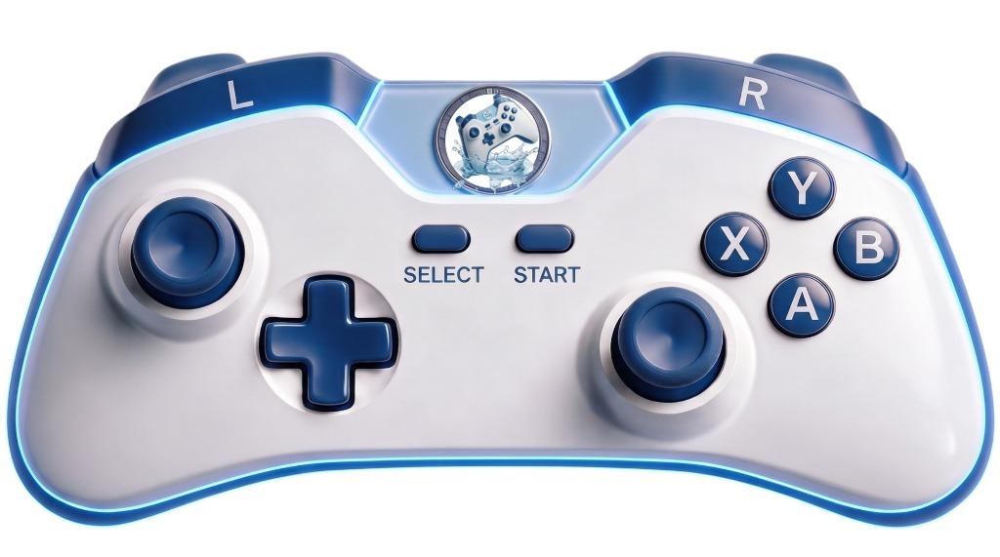

  
  <h1>🎮 MaNette</h1>
  
<b>Transformez votre smartphone Android en une véritable manette de jeu Bluetooth pour votre PC.</b>

  

  

    
    
    
  

---

Bienvenue sur le dépôt officiel de **MaNette**, l'application qui vous fait faire des économies en transformant l'appareil que vous avez déjà dans votre poche en un contrôleur premium pour PC.

## ✨ Fonctionnalités Principales

*   ⚡ **Zéro Latence** : Connexion Bluetooth HID optimisée. Votre ordinateur reconnaît l'application comme une manette physique instantanément.
*   🎯 **Précision Chirurgicale** : Joysticks analogiques 360°, croix directionnelle réactive, boutons complets (ABXY, L/R, Start, Select).
*   🌊 **Design Immersif (Glassmorphism)** : Interface épurée, zones tactiles invisibles placées parfaitement sur un visuel de manette ultra-moderne.
*   ♻️ **Écologique & Économique** : Plus besoin de dépenser 70€ ou de jeter du plastique. Votre smartphone suffit.

## 🚀 Comment l'utiliser ?

1.  **Téléchargez** le fichier `MaNette.apk` disponible dans ce projet ou sur notre site web.
2.  **Installez** l'application sur votre smartphone Android (Android 9+ recommandé).
3.  **Associez** votre téléphone à votre ordinateur via les paramètres Bluetooth de votre PC.
4.  **Lancez** MaNette sur votre téléphone et appuyez sur "Lancer la manette".
5.  **Jouez !** Votre PC détecte immédiatement une manette, aucun logiciel tiers n'est requis sur l'ordinateur.

## 📁 Structure du projet

Ce dépôt contient tout l'écosystème MaNette :
*   `/app` et autres dossiers : Le code source complet de l'application Android (Kotlin, XML, Gradle).
*   `/website` : Le code source du site web promotionnel de l'application (HTML, CSS Glassmorphism).
*   `MaNette.apk` : L'exécutable Android prêt à être installé.

## 👨‍💻 À propos de l'auteur

Créé avec passion par **Maxadis**.  
*L'application innovante qui métamorphose votre smartphone en un contrôleur PC ultra-réactif. Ne dépensez plus, jouez plus.*

---
*Ce projet démontre l'utilisation du profil Bluetooth HID (Human Interface Device) sur Android.*
